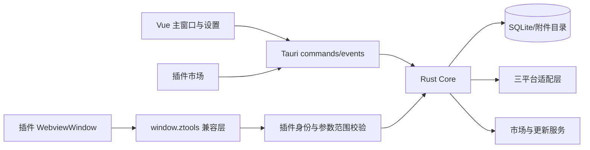

# ZTools 核心功能迁移到 Tauri 2 实施方案

## 1. 迁移目标

本方案以 `/home/sun/ZTools` 的 Electron 3.2.0 为行为基线，在 `/home/sun/ZTools-Tauri` 中重构一个可正式替代原版核心使用场景的 Tauri 2 应用。

核心版不是单纯的应用启动器。它必须同时具备：

1. 应用、文件、目录、系统命令和插件指令的统一搜索与启动。
2. 插件安装、加载、运行、退出、更新和开发调试能力。
3. 可正常浏览、下载、安装和升级插件的插件市场。
4. 覆盖常用插件的 `window.ztools` API 兼容层。
5. 数据迁移、设置、桌面交互、同步、更新和三平台发行能力。

当前无插件宿主是这项工作的基础，不代表核心迁移完成。

截至 2026-09-15，首批插件链路已落地：官方市场目录和 ZIP 安装、`plugin.json` 校验、独立插件 Webview、私有资源协议、文本/正则/files feature，以及生命周期、数据库/附件、dbStorage、动态 feature、文本剪贴板、受限文件/Shell/网络和异步对话框 API。`timestamp`、`calculation-paper` 可原包运行；`file-renamer` 和 `web-quick-open` 由不执行 Node 的内置 Rust 适配桥实测通过。窗口、屏幕、输入、开发热重载、完整市场安装保障和其余代表插件仍按本方案继续，不能据此把核心迁移标为完成。

## 2. 范围边界

### 2.1 本次必须迁移

| 能力 | 核心交付内容 |
| --- | --- |
| 启动器 | 应用扫描、图标、拼音搜索、历史、收藏、别名、本地快捷方式、系统命令 |
| 桌面集成 | 全局快捷键、托盘、单实例、开机启动、窗口定位、焦点、剪贴板、拖放、截图 |
| 插件运行时 | `plugin.json`、features、UI/list/none、生命周期、插件窗口和数据隔离 |
| 插件市场 | 列表、分类、搜索、详情、下载、安装、升级、卸载、进度、失败回滚 |
| 插件 API | 生命周期、UI、feature、数据库、存储、剪贴板、文件、对话框、Shell、Toast、设备、屏幕、基础输入和基础窗口能力 |
| 插件开发 | 本地开发目录、热重载、日志、开发/正式身份隔离、打包检查 |
| 数据 | SQLite 主库、插件数据和附件、旧 LMDB 只读导入、备份恢复 |
| 发布 | Windows、macOS、Linux 安装包、签名、更新和回滚 |

### 2.2 本次暂不迁移

- 官方账号、官方云同步和多账号路由。
- 官方 AI、AI Chat、模型市场和 Provider 平台。
- 支付和爱发电窗口。
- MCP Server。
- zbrowser/ubrowser 浏览器自动化。
- FFmpeg 专用插件 API。
- 超级面板和悬浮球。
- HTTP Server、复杂代理和心跳上报。
- Electron `BrowserWindow`、`WebContents` 全部 165 个代理方法的逐项仿真。

暂不迁移的 API 必须在兼容台账中明确返回“当前宿主不支持”，并提供能力检测。禁止提供空对象、假成功或永久 pending 的 Promise。

## 3. 完成定义

只有同时满足以下条件，才能把“核心迁移”标为完成：

1. 不安装插件时，启动器、设置、剪贴板、截图和系统命令能够独立使用。
2. 插件市场能够完成真实插件的查询、安装、升级和卸载。
3. 至少 6 个代表插件完成真实场景验收，其中简单插件争取原包不改。
4. 所有公开插件 API 都进入机器可读台账，并被标记为“核心支持”“需要插件适配”或“本期不支持”。
5. 标记为核心支持的 API 具有参数、返回值、错误、同步/异步和事件顺序测试。
6. 插件之间不能读取彼此数据、调用彼此窗口或继承彼此权限。
7. Windows、macOS 和 Linux 完成真机安装和核心场景验证。
8. 发布程序不包含 Electron、Node.js、Bun、Deno 或任何 JavaScript 后台 sidecar；Node.js 只允许作为前端开发构建工具。

## 4. 技术架构



### 4.1 主程序边界

- Vue 负责搜索、设置、市场和插件页面容器。
- Rust 负责文件、进程、窗口、存储、网络、权限和后台服务。
- 前后端只通过类型化 Tauri command/event 通信。
- 主窗口、设置窗口和每个插件窗口使用不同 capability；当前核心版不提供面向用户的逐插件授权界面。
- Rust command 必须再次校验插件身份和参数 scope，不能只依赖前端传入的插件名称。

### 4.2 插件页面

- 使用独立 `WebviewWindow` 加载插件页面，不把第三方页面直接插进主页面 DOM。
- 使用宿主私有协议读取插件资源，阻止目录穿越、远程脚本和任意本地文件访问。
- 在插件业务脚本执行前注入版本化 `window.ztools` 兼容脚本。
- 每次启动产生新的运行实例 ID；事件、数据、窗口和后台任务都绑定该实例。
- 插件退出、崩溃、升级或卸载时清理监听器、窗口、进程、临时目录和数据库句柄。

### 4.3 无 Node 的插件兼容边界

Tauri Webview 没有 Node，发布版也不打包 Node sidecar。插件兼容按以下方式实现：

1. 纯 Web 插件通过注入的 `window.ztools` 直接调用 Rust 服务，尽量保持原包业务代码不变。
2. `path`、`os` 和 `Buffer` 中不访问系统的常用部分由浏览器兼容模块实现。
3. `fs/promises`、`http/https`、剪贴板、Shell 和进程等操作映射到经过权限检查的异步 Rust API。
4. 安装器使用 Rust 实现的静态扫描和转换器处理旧 preload，并可生成派生的浏览器兼容包：把已知 `require` 映射到兼容模块。转换过程不调用 Node/npm；原 ZIP 和哈希保留，生成物进入独立缓存。
5. 同步 `fs`、动态 `require`、`.node` 原生模块、深度 Electron 对象和 Node/DOM 混写代码无法自动等价运行，必须修改插件 preload 或把服务重写到 Rust。
6. 市场在安装前展示兼容结论；不兼容插件不会通过启动失败来试错，也不会临时下载 Node 运行时。

这种方案让使用标准 `window.ztools` API 的插件保持兼容，同时保证发布应用中不存在 Node 运行时。插件自身绕过 ZTools API 直接依赖 Node/Electron 时，需要发布对应的 Tauri 适配版本。

### 4.4 同步 API

现有审计中 351 个命名 API 有 64 个涉及同步 IPC。Tauri `invoke` 是异步调用，因此同步兼容必须单独处理：

- 平台、版本、主题、窗口类型等 getter 在插件启动前注入快照。
- feature 和轻量状态在兼容层内同步维护，再异步持久化。
- 同步数据库先验证“启动预载 + 本地同步镜像 + 持久化事务日志”。
- 无法保证崩溃一致性和跨平台时序时，插件必须改用 `db.promises`。
- 对话框、窗口创建、进程和系统副作用不能伪造同步完成。

## 5. 核心插件 API 范围

### 5.1 第一批：必须兼容

| API 组 | 典型能力 | 验收重点 |
| --- | --- | --- |
| lifecycle | `onPluginEnter/onPluginOut/onPluginReady/outPlugin` | 晚注册重放、重复注册、退出清理 |
| device | 平台、版本、设备 ID、开发模式 | 同步快照稳定，设备 ID 延续 |
| UI | 子输入框、窗口高度、焦点、隐藏、退出 | 中文输入法、Esc、焦点和尺寸 |
| toast/notification | Toast、系统通知 | 权限拒绝和后台窗口 |
| feature | 读取、注册、更新、删除指令 | 注册完成屏障和搜索索引刷新 |
| db/db.promises | 文档增删改查、附件 | 同步边界、冲突、隔离和异常 |
| dbStorage | 插件键值存储 | 同步返回、持久化和卸载策略 |
| clipboard | 文本、图片、文件、监听、隐藏粘贴 | 数据格式、恢复前台应用和顺序 |
| dialog | 打开、保存、消息和路径选择 | 取消语义、默认目录和权限 |
| shell/tools | 打开路径、外部链接、终端、文件操作 | 参数校验、路径 scope 和退出码 |
| screen | 显示器、游标、截图、取色 | 多屏、缩放、权限和坐标 |
| input | 基础键盘输入和粘贴 | 平台权限、按键顺序和失败可见 |
| window | 基础创建、关闭、移动、大小、置顶和消息 | 父子关系、销毁和跨窗事件 |

### 5.2 暂不支持但必须可检测

- `ai/aiChat/allAiModels`。
- `payment`。
- `providers/translate/ocr`。
- `zbrowser/ubrowser`。
- `runFFmpeg`。
- Electron 原生句柄、进程 ID、离屏渲染、heap snapshot 等高级窗口代理方法。
- `internal.*` 中仅服务于账号、AI、支付、MCP、超级面板和悬浮球的接口。

新版 SDK 增加 `hasCapability(name)` 和宿主能力清单。插件市场在安装前显示“不兼容”“需要适配”或“可直接运行”，避免安装后才静默失败。

## 6. 实施阶段

### 阶段 0：冻结核心清单

1. 固定原项目 commit、锁文件、测试和插件 API CSV。
2. 从 351 个 API 中生成核心 API 清单，记录同步性、参数、返回值、事件和权限。
3. 固定代表插件 ZIP、版本、哈希和测试步骤。
4. 建立 Electron 原版行为录制和 Tauri 对照结果格式。

退出条件：每个核心模块和 API 都有实现任务及测试 ID，没有“其他待迁移”这种笼统条目。

### 阶段 1：解决插件运行阻断项

完成三个原型：

1. 时间戳插件：验证插件加载、生命周期、复制和退出。
2. 计算稿纸插件：验证同步数据库是否能够兼容。
3. 文件批量重命名插件：验证 Webview、Rust 文件 API、拖放和 preload 兼容转换。

退出条件：明确哪些插件可原包运行、哪些只需改 preload、哪些需要重写服务。同步数据库方案必须在三种系统 Webview 上验证后定稿。

### 阶段 2：补齐启动器宿主

- Windows UWP、系统设置、协议、快捷方式参数、管理员启动和图标。
- macOS bundle ID、前台应用激活、权限和真实图标。
- Linux Desktop Entry、Flatpak/Snap、X11/Wayland 和图标主题。
- 内置系统命令、URL、文件、应用和插件 feature 的统一命令模型。
- 固定排序、历史、别名、禁用指令、推荐和搜索权重。
- 主窗口键盘导航、中文输入法、失焦、Esc、紧凑模式和多屏定位。

退出条件：原版不依赖插件的启动器 E2E 在 Tauri 开发态通过。

### 阶段 3：补齐桌面能力

- 文本、HTML、图片和文件剪贴板。
- 剪贴板历史、自动清理、隐藏后粘贴和剪贴板恢复。
- 文件拖入/拖出和可信路径桥。
- 整屏、窗口、显示器、交互选区截图和取色。
- 全局快捷键和核心输入模拟；Wayland 使用桌面门户并显示能力状态。
- 前台应用识别、激活和多屏坐标转换。

退出条件：在真实外部应用中验证粘贴、拖放、截图和窗口激活，不能只检查 Webview 状态。

### 阶段 4：实现插件运行时

- `plugin.json` 校验、静态/动态 features 和版本限制。
- UI/list/none 三种模式和生命周期事件。
- 插件 Webview、基础子窗口、父子消息、单例、多开和后台运行。
- 插件身份、session、缓存、数据和开发目录隔离。
- `window.ztools` 兼容脚本和新版异步 SDK。
- 插件崩溃、强退、升级和卸载后的资源回收。

退出条件：时间戳和计算稿纸可运行，插件越权测试通过，退出后无遗留窗口、监听器或进程。

### 阶段 5：实现核心插件 API

按以下顺序完成实现、契约测试和代表插件验证：

1. lifecycle、device、toast、notification、基础 UI。
2. feature、db.promises、db、dbStorage。
3. clipboard、dialog、shell、tools、screen。
4. input 和基础 window API。
5. 开发插件内部 API 和设置插件需要的 `internal.*` 子集。

退出条件：核心 API 台账全部有结果；兼容通过项都有自动化契约测试；不支持项能稳定检测并给出明确错误。

### 阶段 6：插件市场和安装器

- 市场分类、搜索、详情、版本、平台和兼容等级。
- 下载进度、取消、哈希/签名、大小限制和安全解包。
- staging 安装、原子替换、升级失败回滚和卸载清理。
- `.zpx` 兼容、本地包安装和开发目录注册。
- 宿主最低版本检查；逐插件授权声明和变更提醒留到核心稳定后的增强版本。
- 插件更新、禁用、启用和数据保留选项。

退出条件：在线安装、离线安装、升级失败回滚和卸载均完成真实测试。

### 阶段 7：设置、数据迁移和更新

- 补齐核心设置：快捷键、窗口、搜索、剪贴板、插件、市场、数据、同步和更新。
- 迁移插件元数据、插件数据库、附件、固定项、历史、别名和设置。
- 原 LMDB 全程只读；支持重复导入、中断恢复和导入报告。
- 共享目录同步覆盖核心宿主数据；插件数据默认不同步，除非定义清晰的冲突协议。
- 配置真实 Tauri 更新地址、公钥、签名包和失败恢复。

退出条件：源数据哈希不变，迁移后记录数和附件哈希可核对，真实签名更新链路通过。

### 阶段 8：代表插件验收

| 插件 | 核心验收内容 | 目标 |
| --- | --- | --- |
| 时间戳 | 生命周期、复制、退出 | 原包运行 |
| 计算稿纸 | 同步数据库 | 原包或仅存储适配 |
| 剪贴板 | 异步数据库、文件信息、剪贴板 | 允许改 preload |
| 文件批量重命名 | 文件 API、拖放和 Electron 替代 | 允许改 preload |
| 网页快开 | 网络、DOM/Canvas、动态 feature | 明确适配量 |
| 悬浮 | 透明置顶基础窗口和消息 | 验证基础 window 子集 |

AI 助手、Provider、音频转 MP3 和快捷命令保留在后续扩展回归集，不作为核心版发布阻断项。

退出条件：6 个插件均有固定包哈希、安装日志、API 轨迹、场景结果和资源清理证据。

### 阶段 9：三平台发行

- Windows x64/arm64：WebView2、UWP、签名、安装、升级、卸载。
- macOS x64/arm64：签名、公证、辅助功能、输入和屏幕权限。
- Linux x64/arm64：deb/AppImage/rpm、WebKitGTK、X11/Wayland 和桌面门户。
- CI 生成 SBOM、签名安装包、更新元数据和插件兼容报告，并检查发布包中不存在 Node/Electron 运行时。
- 演练 Electron 旧版数据导入、Tauri 更新和失败回滚。

退出条件：每个平台至少两个真实环境通过安装、首启、搜索、插件安装运行、剪贴板、截图、更新和卸载。

## 7. 测试要求

每次实现变更必须通过：

```bash
pnpm typecheck
pnpm build:web
cargo fmt --manifest-path src-tauri/Cargo.toml -- --check
cargo clippy --manifest-path src-tauri/Cargo.toml --all-targets -- -D warnings
cargo test --manifest-path src-tauri/Cargo.toml
```

桌面交互必须以 `pnpm dev` 启动真实 Tauri 窗口验证。测试数据全部进入临时目录，不读写用户正式 `~/.ztools`。原 Electron 仅用于行为对照，并按原项目要求使用源码方式执行 `pnpm test:e2e`。

测试分为：

- Rust 单元和集成测试：路径、权限、数据库、安装事务和资源回收。
- API 契约测试：参数、返回值、错误、同步性、事件顺序和取消。
- Vue 测试：搜索、设置、市场、安装进度和权限提示。
- 桌面 E2E：真实窗口、键鼠、剪贴板、拖放、截图和多屏。
- 插件 E2E：安装、启动、切换、后台、升级、崩溃和卸载。
- 发行测试：签名、安装、更新、回滚、睡眠恢复和卸载。

## 8. 安全规则

1. 插件调用必须绑定真实插件窗口身份，不能由页面伪造插件名称。
2. 文件范围限定到用户选择路径和插件私有目录。
3. Shell 只能调用宿主固定实现并校验参数格式。
4. 内置网络适配器按插件身份、域名和协议限制请求。
5. 安装包防止路径穿越、符号链接逃逸、压缩炸弹和覆盖宿主文件。
6. 安装时生成的兼容包不能扩大宿主 API 范围，且必须能追溯到原包哈希和转换器版本。
7. 日志不得记录 token、Cookie、用户文件内容和剪贴板正文。

## 9. 工程量估算

| 工作流 | 估算工程量 |
| --- | ---: |
| 核心清单与阻断原型 | 3–5 人周 |
| 启动器和桌面能力补齐 | 6–10 人周 |
| 插件运行时和核心 API | 10–16 人周 |
| 市场、安装器和开发流程 | 5–8 人周 |
| 数据迁移、设置和更新 | 4–7 人周 |
| 三平台验证和发行 | 6–10 人周 |

串行总量约 34–56 人周。建议至少配置 Rust/平台、插件兼容、前端/E2E 三个方向。阶段 1 完成后，根据同步数据库和无 Node preload 转换原型的结果重新校准。

## 10. 最终交付物

- Tauri 2/Rust 核心应用和三平台签名安装包。
- 插件运行时、插件市场、安装器和开发插件流程。
- 核心 `window.ztools` SDK、类型包、权限和适配文档。
- 公开 API 兼容台账及所有不支持项的能力检测结果。
- 旧数据只读迁移器、迁移报告和恢复说明。
- 6 个代表插件的固定夹具与验收证据。
- 安装、更新、权限、桌面交互和资源清理报告。

只有这些交付物和各阶段退出条件都满足，才能把 ZTools Tauri 核心迁移标为完成。
